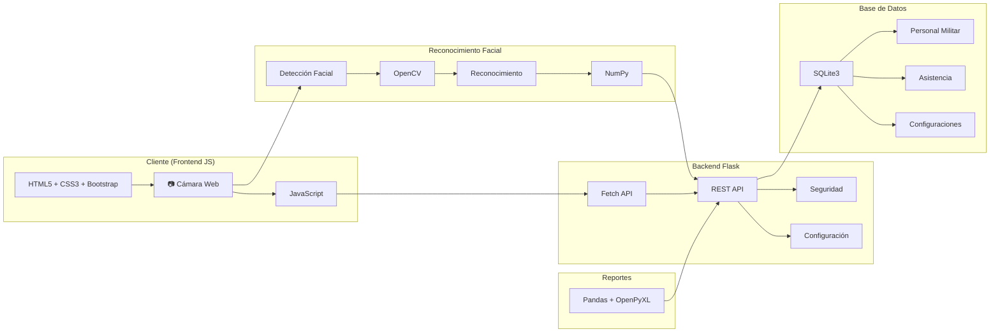
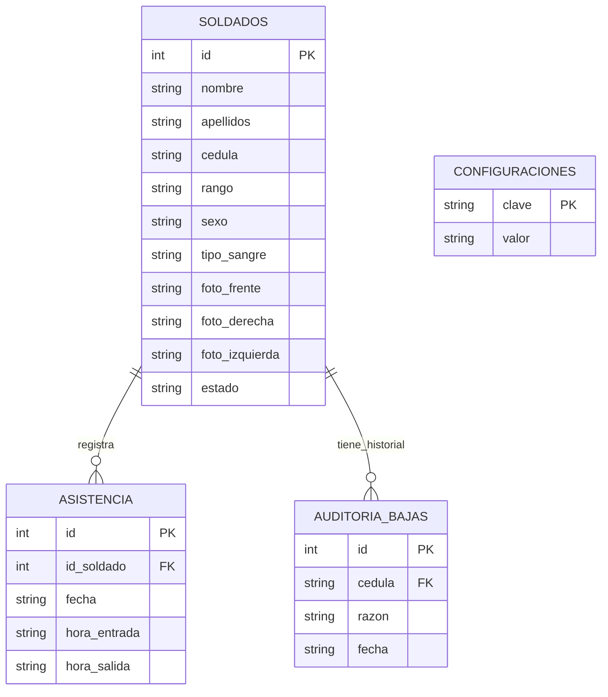
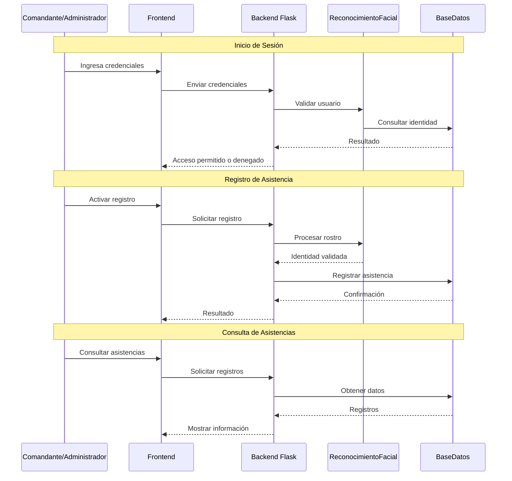

# MilFace

## Sistema de Control de Asistencia Militar mediante Reconocimiento Facial

MilFace es una aplicación web desarrollada para la automatización del control de asistencia del personal militar mediante técnicas de reconocimiento facial. El sistema permite registrar entradas y salidas de forma automatizada, gestionar información del personal y generar reportes de asistencia, reduciendo errores humanos y optimizando los procesos administrativos.

Este proyecto fue desarrollado como parte de la carrera de Ingeniería de Sistemas en la Universidad Nacional Experimental Politécnica de la Fuerza Armada Nacional Bolivariana (UNEFA).

---

# Objetivo General

Desarrollar un sistema web de reconocimiento facial que permita automatizar el proceso de control de asistencia del personal militar, garantizando rapidez, seguridad y confiabilidad en el registro de información.

---

# Funcionalidades Principales

* Registro de personal militar.
* Captura y procesamiento de imágenes faciales.
* Reconocimiento facial automático.
* Registro de entradas y salidas.
* Gestión de asistencia.
* Administración de usuarios.
* Generación de reportes.
* Auditoría de bajas del sistema.
* Gestión de configuraciones internas.

# Instalación

Clonar el repositorio:

```bash
git clone URL_DEL_REPOSITORIO
```

Ingresar al directorio:

```bash
cd MilFace
```

Instalar dependencias:

```bash
pip install -r requirements.txt
```

Ejecutar el sistema:

```bash
python app.py
```

---

# Variables de Entorno

El proyecto utiliza un archivo `.env.example` como referencia para la configuración local.

Ejemplo:

```env
DATABASE_NAME=milfaces.db
PORT=5000
DEBUG=False
```

---

# Arquitectura del Sistema



---

#  Modelo Entidad Relación



---

# Diagrama de Secuencia



---

# Control de Calidad

El proyecto implementa:

* Protección de la rama principal (`main`).
* Pull Requests obligatorios.
* Revisión previa de cambios.
* Conventional Commits.
* GitFlow simplificado.
* Pipeline CI/CD mediante GitHub Actions.

---

# Estado del Proyecto

En desarrollo activo.
Actualmente se encuentra en fase de optimización y fortalecimiento de los módulos de reconocimiento facial, control de asistencia y generación de reportes.

---

# Autor
Estudiante de Ingeniería de Sistemas
Universidad Nacional Experimental Politécnica de la Fuerza Armada Nacional Bolivariana (UNEFA)

---

## Documentación Técnica
Para generar la documentación autogenerada del código, ejecuta en la terminal:
`pdoc app.py -o documentacion/`
